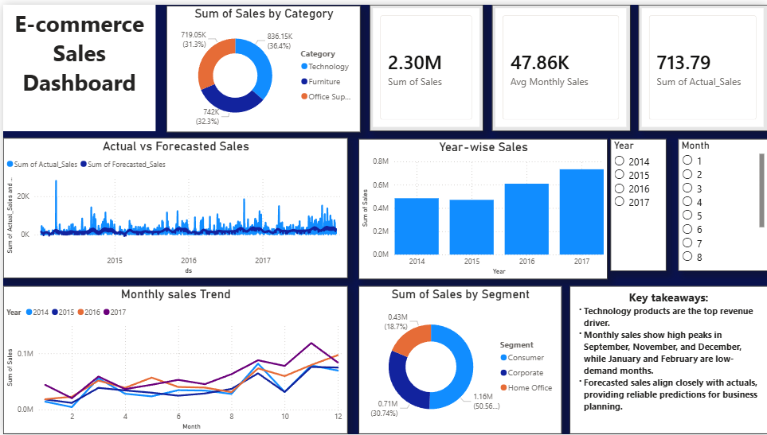

# 📈 AI-Powered Sales Forecasting Dashboard  
### Task 1 – Machine Learning Internship at Future Interns

## 📌 Project Overview
This project was completed as **Task 1** of my **Machine Learning Internship at Future Interns**.  
The goal of this task was to analyze historical retail sales data, forecast future sales using machine learning techniques, and present insights through a structured and interactive **Power BI dashboard** for business decision-making.

## 🎯 Problem Statement
Accurate sales forecasting helps retail businesses:
- Plan inventory efficiently  
- Understand seasonal demand patterns  
- Identify high- and low-performing categories  
- Make data-driven strategic decisions  

This project combines **time-series forecasting** with **data visualization** to address these needs.

## 🛠 Tech Stack Used
- **Python**
  - Pandas
  - NumPy
  - Prophet (Time Series Forecasting)
- **Power BI Desktop**
  - Interactive dashboards
  - DAX measures
- **Jupyter Notebook**
  - EDA & forecasting workflow
- **CSV / Excel**
  - Data storage and preprocessing

## 📂 Project Structure

## 📊 Dataset Description

### 🔹 Processed Datasets
- **category_sales.csv**
  - Category  
  - Sum of Sales  

- **monthly_sales.csv**
  - Month  
  - Year  
  - Sum of Sales  

- **sales_forecast.csv**
  - ds (Date)  
  - Sum of Actual Sales  
  - Sum of Forecasted Sales  

These files were generated from the raw dataset during preprocessing and feature engineering.

## 🔄 Project Workflow
1. Load and clean raw sales data using Python  
2. Perform feature engineering and aggregation  
3. Apply time-series forecasting using Prophet  
4. Export forecast results to CSV  
5. Import processed data into Power BI  
6. Build an interactive dashboard with KPIs, trends, and forecasts  

## 📊 Power BI Dashboard Features
- Total Sales KPI  
- Monthly & yearly sales trends  
- Category-wise sales distribution  
- Actual vs Forecasted sales comparison  
- Interactive filters (Date, Category, Segment, Ship Mode)  
- Business insight cards for decision-making  

## 🖼 Power BI Dashboard Preview

## ▶️ How to Run This Project

### 1️⃣ Forecasting (Python)
- Open `notebooks/ML_1.ipynb`
- Run all cells to:
  - Clean and aggregate data
  - Train the forecasting model
  - Generate `sales_forecast.csv`

### 2️⃣ Power BI Dashboard
- Open `powerbi/MLTask1.pbix`
- Load CSV files from `data/`
- Refresh data if required

## 📌 Key Learnings
- Hands-on experience with time-series forecasting  
- Feature engineering for business analytics  
- Designing structured, professional dashboards  
- Translating ML results into actionable insights  

---

